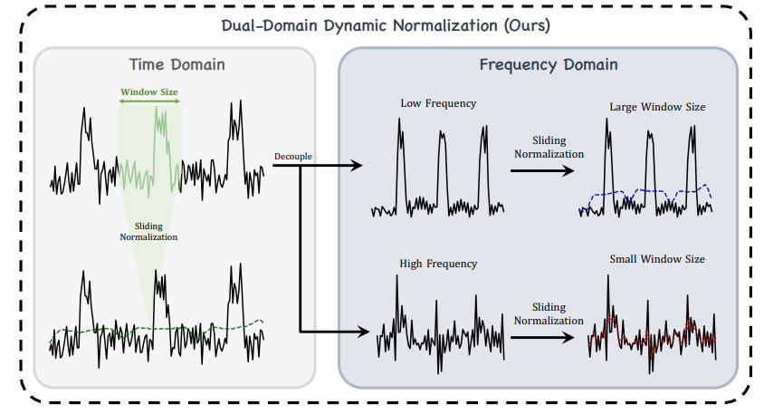
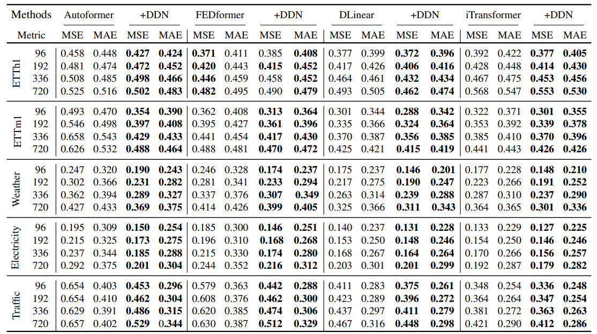
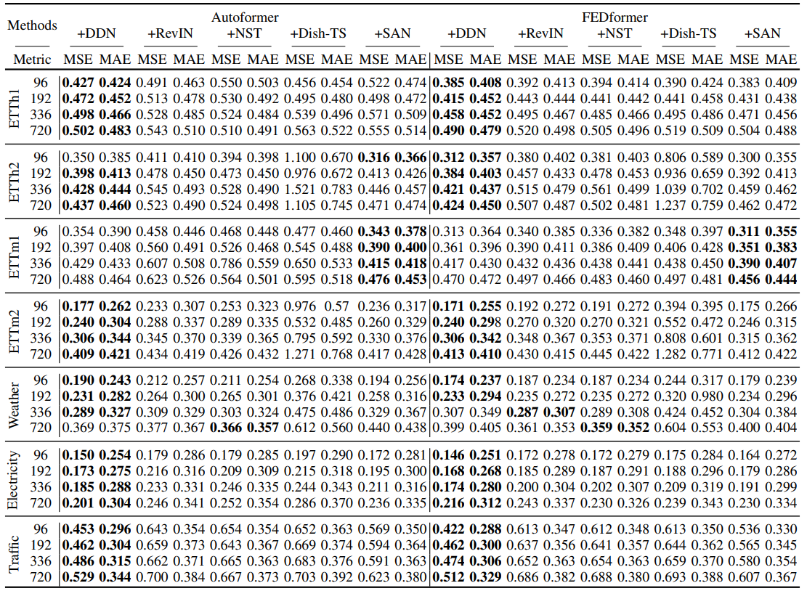

## DDN: Dual-domain Dynamic Normalization for Non-stationary Time Series Forecasting

This repo is the official Pytorch implementation of our NeurIPS 2024 paper: [DDN: Dual-domain Dynamic Normalization for Non-stationary Time Series Forecasting](https://nips.cc/virtual/2024/poster/95167).

### Introduction

In this paper, we introduce a novel Dual-domain Dynamic Normalization (DDN) framework designed to address the challenge of dynamically capturing distribution variations across time and frequency domains. DDN operates in a sliding window fashion, enabling it to detect subtle, time-varying changes in data distributions. DDN performs time-domain normalization to compute local sliding statistics (mean and standard deviation) at each time step, offering a fine-grained approach compared to traditional methods that operate at a coarser level.



We perform comparative experiments across **seven widely-used datasets** using popular forecasting backbones, and further evaluate DDN's performance against other reversible non-stationary approaches.

Multivariate forecasting results:



Comparison with other reversible non-stationary approaches:



### Usage

#### Environment and dataset setup

```bash
pip install -r requirements.txt
mkdir datasets
```

All the datasets are available at the [Google Driver](https://drive.google.com/drive/folders/1ZOYpTUa82_jCcxIdTmyr0LXQfvaM9vIy) provided by Autoformer. Many thanks to their efforts and devotion!

#### Running

We provide ready-to-use scripts for different backbone models. For example, to run DDN with DLinear:

```bash
sh ./scripts/DLinear.sh # scripts for DLinear
```

### Acknowledgement

This repo is built on the pioneer works. We appreciate the following GitHub repos a lot for their valuable code base or datasets:

- [FEDformer](https://github.com/MAZiqing/FEDformer)

- [Autoformer](https://github.com/thuml/Autoformer)

- [DLinear](https://github.com/cure-lab/LTSF-Linear)

- [iTransformer](https://github.com/thuml/iTransformer)

- [SAN](https://github.com/icantnamemyself/SAN)

### Citation

If you find our work helpful, please consider citing our paper:

```bibtex
@article{dai2024ddn,
  title={{DDN}: Dual-domain Dynamic Normalization for Non-stationary Time Series Forecasting},
  author={Dai, Tao and Wu, Beiliang and Liu, Peiyuan and Li, Naiqi and Xue Yuerong and Shu-Tao Xia and Zexuan Zhu},
  journal={Advances in Neural Information Processing Systems},
  year={2024}
}
```
